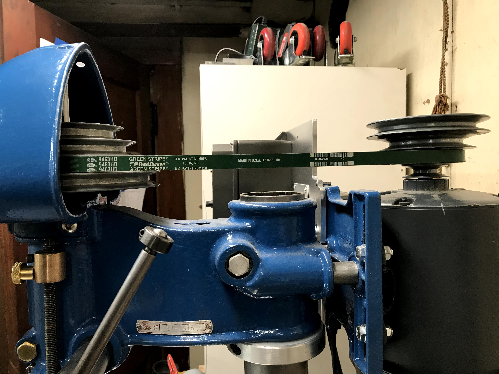
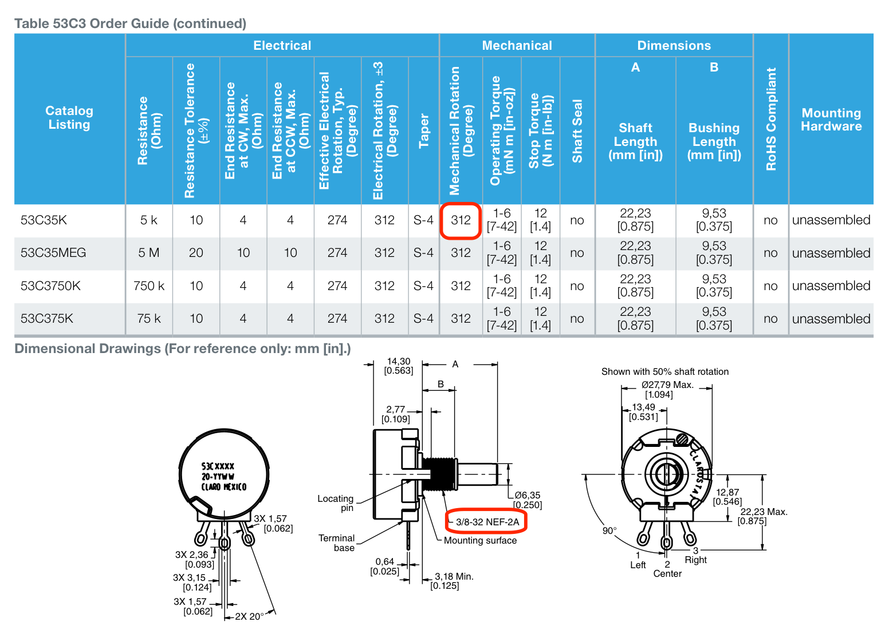
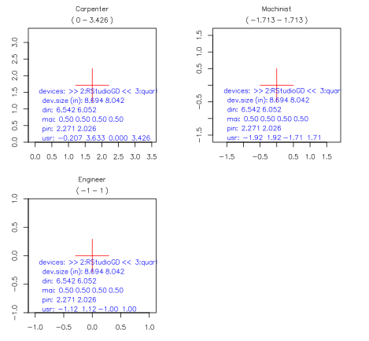
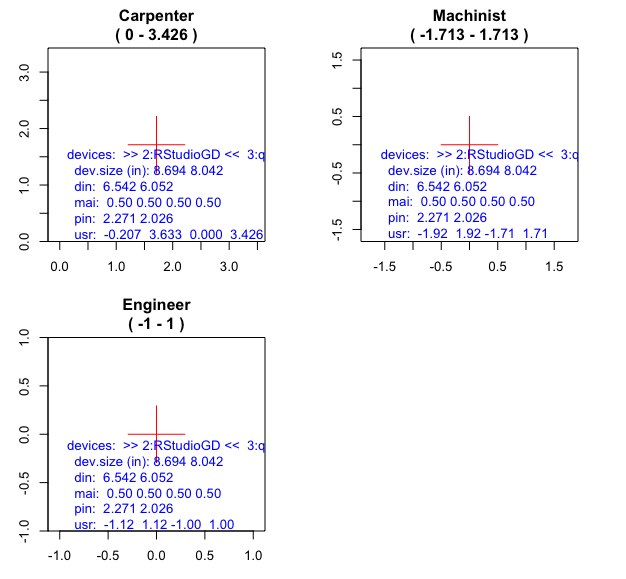

```{r setup, include=FALSE}
knitr::opts_chunk$set(echo = FALSE, fig.align = 'center', out.width = '900px', out.height = '900px')
library(emo)
```

## Project Summary

- Programmatically design a speed dial to set the spindle RPM on a manual machine tool. 
- Output an SVG file for laser etching.

```{r sample-dials, fig.align='default', fig.show = "hold", out.width = "50%", out.height="50%"}
knitr::include_graphics("./images/speed-dial-rotated.jpg")
knitr::include_graphics("./images/8630-F.jpg")
```

## David's Background

- Series of high school shop classes
- PostScript printer driver and firmware development
- Digital photography

## Maker's Creedo

"It will work after the 3rd try"


## The Drill Press

```{r belt-pulleys, fig.align='default', fig.show = "hold", out.height="40%", out.width="40%"}

knitr::include_graphics("./images/dial-view.jpg")
```

## Iteration #1: Inkscape

- Inkscape is wonderful
- Manual process works better with fewer variables

## Iteration #2: R

- Develop code with Rnotebook
- Have R figure out the scale values
- Weird scale values, quicker to pick by hand
- Historical footnote: _Machine Dials and Scales_ WR Machine Design v21 n8 Aug 1949, pp.98-105

\<\<Show Rnotebook code\>\>

## Iteration #3: Plot Text on a Circle

- Exploratory coding showed this would be much work

## Iteration #3: Search for an R Package

- Polar coordinate packages would need work
- Circular visualization packages had the features

## Iteration #3: Selecting a Circular Visualization Package

- The contestants: circlize, BioCircos, RCircos, CIRCUS, and OmicCircos
- The winner: `circlize` comes with a book!

In 2009, Martin Krzywinski announced his Perl program, _Circos_, in his 
[“Circos: an Information Aesthetic for Comparative Genomics”](https://genome.cshlp.org/content/early/2009/06/15/gr.092759.109.abstract) paper.

## Plot Examples

```{r pokemon}
knitr::include_graphics("./images/circular-pokemon-1.png")
```

##

```{r doodle}
knitr::include_graphics("./images/doodle.jpeg")
```

##  

```{r death-star}
knitr::include_graphics("./images/too-much-data-example.jpeg")
```

---

```{r clock}
knitr::include_graphics("./images/clock-1.svg")
```

## 

```{r separate_nested_plots}
knitr::include_graphics("./images/circlize-nested-1.svg")
```

## Coding the Dial

What makes `circlize` tick?

```{r circos-init-line, eval=FALSE, echo=TRUE}
plot(circos.par("canvas.xlim"), circos.par("canvas.ylim"), 
     type = "n", ann = FALSE, axes = FALSE, asp = 1
)
```

R's built-in basic plotting package `graphics` is the foundation.
  
  
  
No `ggplot`, not this time

## R's Plotting Basics 1/2

Need a graphic output device of some kind to display results.

- `grDevices` contains R's graphic devices and rasterizer
- `dev.*()` functions control them

```{r default-device, echo=TRUE, eval=FALSE}
getOption("device") # for default device
```

## R's Plotting Basics 2/2

- R thinks about plotting regions
- Terminology a bit confusing
- `graphics` is the underlying package
- `plot()` is the underlying function
- `par()` with its **72** parameters controls plots

`r emo::ji("point_right")` demo `par()`

## RStudio's Graphic Device

```
options("device")
$device
[1] "RStudioGD"
```

- Zoomable and resizeable
- Dimensions are fixed

Will not generate a pixel accurate preview of the SVG file

Sample of RStudio issues:

- [Figure size in RStudio is different than in rendered output](https://github.com/rstudio/rstudio/issues/4521)
- [Plots with fixed `fig.width` are rendered differently in rstudio and knitr output](https://github.com/rstudio/rstudio/issues/4913)

## Simplying Plot Parameters

Only interested in creating a full size SVG graphic

plot region + margins = figure region = device region

```{r simplify-plotting, echo=TRUE, eval=FALSE, out.height="75%", out.width="75%"}
par(
  mai = c(0, 0, 0, 0), # No margins
  ann = FALSE,         # No annotations
  xaxs = "i",          # No 4% extra range 
  yaxs = "i"           # # No 4% extra range 
  ) 
plot(
  asp = 1,             # 1:1 aspect ratio
  axes = FALSE         # No axes
  )
```


```{r plot-regions-2, echo=TRUE, out.height="75%", out.width="75%"}
par(mfrow = c(1, 2), omi = c(0.3, 0.3, 0.3, 0.3), xaxs = "i", yaxs = "i")
plot(x = c(0, 2), y = c(0, 3), asp = 1, fg = "red")
box("figure", col = "lightblue")

par(mai = c(0,0,0,0))
plot(x = c(0, 2), y = c(0, 3), asp = 1, ann = FALSE, axes = FALSE, fg = "red")
box("figure", col = "blue")
box("outer", col = "black")
```


## The Plan

1. Collect the physical information
1. `par` - create diagnostic code
1. `plot` - draw reference marks
1. `circlize` - draw outer most band
1. `circlize` - remove extraneous space
1. `r emo::ji("thinking")` positioning info for next band
1. `plot` - font choice
1. `circlize` - visual asthetics
1. `r emo::ji("thinking")` create SVG file

## Physical Information

```{r physical-info, echo=TRUE, eval=FALSE}
mounting_hole_dia_in <- 0.375
dial_gap_mm <- 2 # leave space around outside of dial
dial_diameter_in <- mm_to_in(45 + 2 * dial_gap_mm)
dial_outer_edge_dia_in <- 3.426 # 246.67px, width of the flat part of the chasis cover
dial_rotation <- 312 # degrees
start_angle <- 270 - (360 - dial_rotation)/2
stop_angle <- 270 + (360 - dial_rotation)/2
```

```{r pot-specs, out.height="80%", out.width="80%"}

```

## Diagnoistic Functions

When things don't turn out as expected:

- `r emo::ji("hankey")` insert a bunch of print statements
- `r emo::ji("confounded")` step through w/a debugger
- `r emo::ji("bulb")` write a function than can be reused

```{r diag-demo, echo=FALSE}
suppressMessages(suppressWarnings(source("../explr_graphics.R")))
plot(x = 0, y = 0, xaxs = "i", yaxs = "i")
text(-1, 0.5, adj = 0, labels = explr_graphics(), col = "blue")
```

## Reference Marks | Overview

- Secondary operations need alignment marks
- carpenter - origin is a corner
- machinist - origin centered
- engineer - origin centered, unit scale

## Reference Marks | Rmarkdown Rendering

```{r reference-marks, echo=FALSE, fig.width=6, fig.height=6}
mm_to_in <- function(mm) {return(mm * 25.4)}
width <- 3.426
par(mai = c(0.5, 0.5, 0.5, 0.5), xaxs = "i", yaxs = "i")
par(omi = c(0, 0, 0, 0), mfrow = c(2, 2))
carpenter <- function() {
  range <- c(0, width)
  title <- paste("Carpenter\n(", range[1], "-", range[2], ")")
  plot(
    main = title,
    x = c(range[1], range[2]),
    y = c(range[1], range[2]),
    asp = 1,
    type = "n",
    ann = FALSE,
    xaxs = "i",
    yaxs = "i"
  )
  title(main = title)
  zero <- width / 2
  segments(
    x0 = c(zero - 0.5, zero),
    x1 = c(zero + 0.5, zero),
    y0 = c(zero, zero - 0.5),
    y1 = c(zero, zero + 0.5),
    col = "red"
  )
  text(0, 2, adj = 0, labels = explr_graphics(), col = "blue")
  box("figure", col = "lightblue")
}
machinst <- function() {
  range <- c(-width/2, width/2)
  title <- paste("Machinist\n(", range[1], "-", range[2], ")")
  plot(
    main = title,
    x = c(range[1], range[2]),
    y = c(range[1], range[2]),
    asp = 1,
    type = "n",
    ann = FALSE,
    xaxs = "i",
    yaxs = "i"
  )
  title(main = title)
  zero <- 0
  segments(
    x0 = c(zero - 0.5, zero),
    x1 = c(zero + 0.5, zero),
    y0 = c(zero, zero - 0.5),
    y1 = c(zero, zero + 0.5),
    col = "red"
  )
  text(-1.7, 0.5, adj = 0, labels = explr_graphics(), col = "blue")
  box("figure", col = "lightblue")
}
engineer <- function() {
  range <- c(-1, 1)
  title <- paste("Engineer\n(", range[1], "-", range[2], ")")
  plot(
    main = title,
    x = c(range[1], range[2]),
    y = c(range[1], range[2]),
    asp = 1,
    type = "n",
    ann = FALSE,
    xaxs = "i",
    yaxs = "i"
  )
  title(main = title)
  sf = 2 / width
  zero <- 0
  segments(
    x0 = c(zero - 0.5 * sf, zero),
    x1 = c(zero + 0.5 * sf, zero),
    y0 = c(zero, zero - 0.5 * sf),
    y1 = c(zero, zero + 0.5 * sf),
    col = "red"
  )
  text(-1, 0.1, adj = 0, labels = explr_graphics(), col = "blue")
  box("figure", col = "lightblue")
}

carpenter()
machinst()
engineer()
```

## Reference Marks | RStudio's SVG Export

```{r rstudio-coord-systems-svg}

```

## Reference Marks | RStudio's PNG Export

```{r rstudio-coord-systems-png}

```

## Circlize: Plot Sequence

1. `par()`
1. `circos.par()`
1. `circos.initialize()`
1. `circos.track()`
1. `par(new)` <----- The Trick

## Circlize: Visual Model

\<\<Get page from book to explain terminology\>\>

## Circlize: Independent Factors

\<\<code showing how factors sets the entire scale\>\>

## Circlize: Outer Band

## Circlize: Parameters

## Circlize: Nested Plots

"Your mission, should you decide to accept", is to calculate the precise
value for `canvas.xlim` and `canvas.ylim`.

```{r separate_nested_plots-2, out.height="500px", out.width="500px"}
knitr::include_graphics("./images/circlize-nested-1.svg")
```
```{r seperate_nest_plot_code, echo=TRUE, eval=FALSE}
factors = letters[1:4]
circos.initialize(factors = factors, xlim = c(0, 1))
circos.track(ylim = c(0, 1), panel.fun = function(x, y) {
    circos.text(0.5, 0.5, "outer circos", niceFacing = TRUE)
})
circos.clear()

par(new = TRUE) # <- magic
circos.par("canvas.xlim" = c(-2, 2), "canvas.ylim" = c(-2, 2)) # <- more magic
factors = letters[1:3]
circos.initialize(factors = factors, xlim = c(0, 1))
circos.track(ylim = c(0, 1), panel.fun = function(x, y) {
    circos.text(0.5, 0.5, "inner circos", niceFacing = TRUE)
})
circos.clear()
```


## Circlize: Coordinate System

\<\<Nesting plots\>\>

## Circlize: Tips

- `circos.info()`
- `circos.info(plot = TRUE)`

## Writing an SVG File 1/2

```{r svg-1, eval = FALSE, echo=TRUE}
svg("my.svg")
plot(blah, blah, blah)
dev.off()
```

Issue: Incomplete or open files may result

## Writing an SVG File 2/2

\<\<R.devices to be added\>\>

## Half way there! 
What else could there be?

## Fonts `r emo::ji("cartwheel")``r emo::ji("cartwheel")``r emo::ji("cartwheel")`

- Legibility important for safe operation
- Space contraints need to be solved
- Layout contributes to efficient operation

## Not All Fonts Are Equal `r emo::ji("confounded")`

- Format (PostScript Type1, **TrueType**, Open Font)
- Glyph set
- Encoding
- Included vs Free vs Paid

## The Fun Part - Picking a Font

`extrafont`

```{r quartz-fonts, echo=TRUE}
quartzFonts()
```

\<\<add examples of different fonts\>\>

## The Finished Dial

\<\<Include SVG file here\>\>

## Summary

1. Manipulate canvas to show nested independent plots
1. `par(new)` to layer new plot on top of existing one
1. `plot(asp = 1)` force 1:1 aspect ratio
1. `plot(type = 'n')` configure a new plot w/out drawing
1. `background = NA` to draw _no_ background
1. Always end w/`circos.clear()`

**Contact Info:**  
\ \ \ \ dgabbe@acm.org  
\ \ \ \ [github.com/dgabbe](https://github.com/dgabbe)  
\ \ \ \ [linkedIn.com/in/davidgabbe](https://www.linkedin.com/in/davidgabbe/)

## R Ecosystem

Packages used:

- circlize
- dplyr
- extrafonts
- R.Devices (verify)
- tibble

## References

- [_Circular Visualization in R_](https://jokergoo.github.io/circlize_book/book/), Zuguang Gu
- [_How Big is Your Graph?_](https://rstudio.com/wp-content/uploads/2016/10/how-big-is-your-graph.pdf) Cheat Sheet
- [_R Graphics_](https://books.google.com/books?id=HouADwAAQBAJ&printsec=frontcover), Paul Murrel, p.99
- Zev Ross' Blog: [Tips and tricks for working with images and figures in R Markdown documents](https://www.zevross.com/blog/2017/06/19/tips-and-tricks-for-working-with-images-and-figures-in-r-markdown-documents/)
- https://www.r-bloggers.com/changing-the-font-of-r-base-graphic-plots/

## Thanks

## Credits

Gu, Z. circlize implements and enhances circular visualization 
  in R. Bioinformatics 2014
  
## Contact Info

David Gabbé

dgabbe@acm.org  
[github.com/dgabbe](https://github.com/dgabbe)  
[linkedIn.com/in/davidgabbe](https://www.linkedin.com/in/davidgabbe/)

## Extra Material

## Measuring Pixels

- [Measuring Pixels](http://blog.pmean.com/measuring-pixels/)
- [Drawing circles](http://blog.pmean.com/circle/)
- [Example of converting between user and device spaces](http://blog.pmean.com/rotating-text/)

## decode this

Reprex didn't capture the graphics state - look into what happened!

``` r
  dev.list()
#> quartz_off_screen 
#>                 2
  dev.cur()
#> quartz_off_screen 
#>                 2
  dev.size(units = "in")
#> [1] 7 5
  par("din")
#> [1] 7 5
  par("mai")
#> [1] 1.02 0.82 0.82 0.42
  par("pin")
#> [1] 5.76 3.16
  par("usr")
#> [1] 0 1 0 1
```

<sup>Created on 2020-01-10 by the [reprex package](https://reprex.tidyverse.org) (v0.3.0)</sup>


