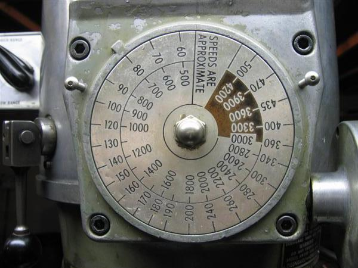
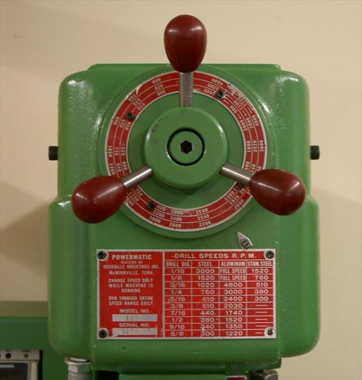
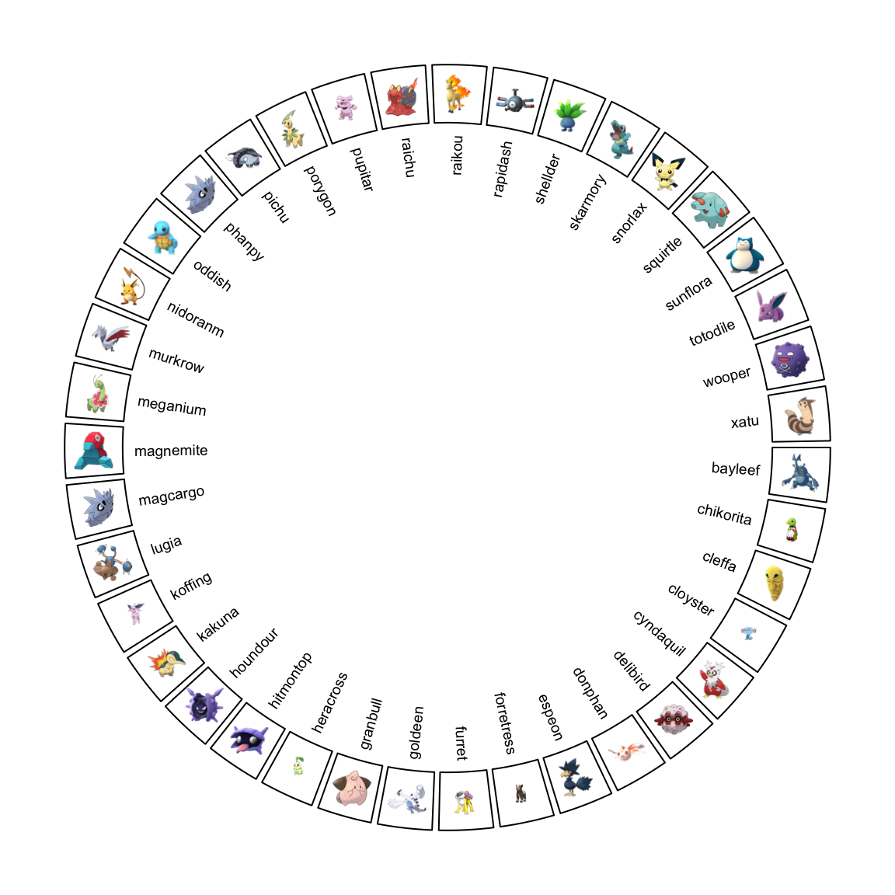
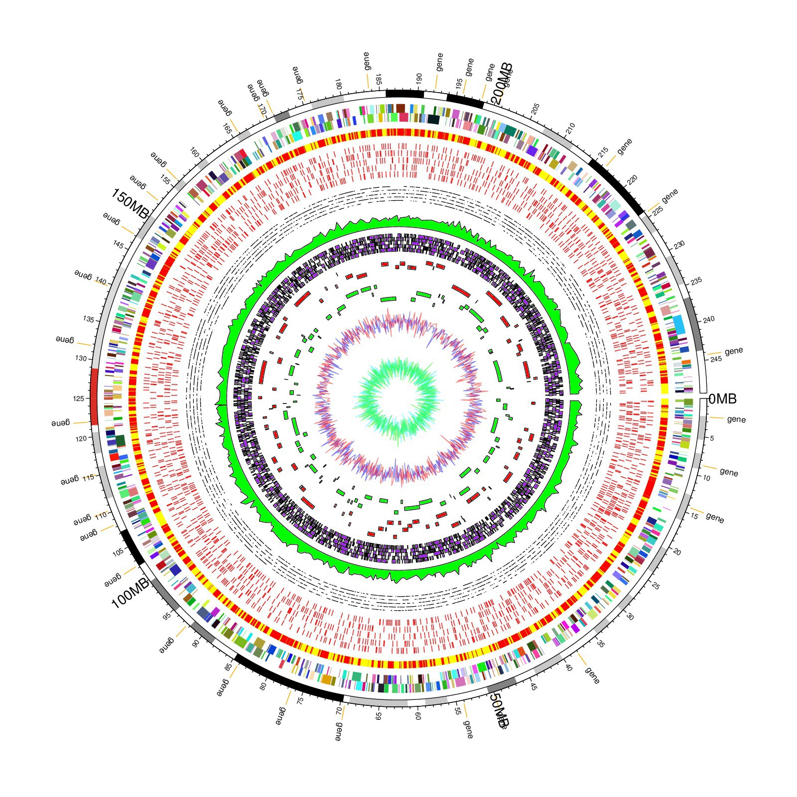
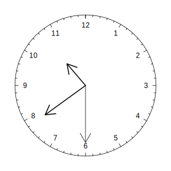
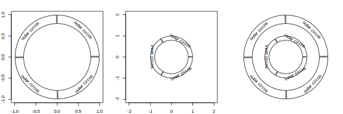

```{r setup, include=FALSE}
knitr::opts_chunk$set(echo = FALSE, fig.align = 'center', out.width = '900px', out.height = '900px')
```

Code to output to different directory:
<!-- knit: (function(inputFile, encoding) {  -->
<!--       out_dir <- 'test'; -->
<!--       rmarkdown::render(inputFile, -->
<!--                         encoding=encoding,  -->
<!--                         output_file=file.path(dirname(inputFile), out_dir, 'analysis.html')) }) -->

## Project Summary

- Programmatically design a speed dial to set the spindle RPM on a manual machine tool. 
- Output an SVG file for laser etching.

```{r sample-dials, fig.align='default', fig.show = "hold", out.width = "50%", out.height="50%"}


```

## David's Background

- Series of high school shop classes
- PostScript printer driver and firmware development
- Digital photography

## Maker's Creedo

"It will work after the 3rd try"


## Iteration #1: Inkscape

- Inkscape is wonderful
- Manual process works better with fewer variables

## Iteration #2: R

- Develop code with Rnotebook
- Have R figure out the scale values
- Weird scale values, quicker to pick by hand
- Historical footnote: _Machine Dials and Scales_ WR Machine Design v21 n8 Aug 1949, pp.98-105

\<\<Show Rnotebook code\>\>

## Iteration #3: Plot Text on a Circle

- Exploratory coding showed this would be much work

## Iteration #3: Search for an R Package

- Polar coordinate packages would need work
- Circular visualization packages had the features

## Iteration #3: Selecting a Circular Visualization Package

- The contestants: circlize, BioCircos, RCircos, CIRCUS, and OmicCircos
- The winner: `Circularize` comes with a book!

In 2009, Martin Krzywinski announced his Perl program, _Circos_, in his 
[“Circos: an Information Aesthetic for Comparative Genomics”](https://genome.cshlp.org/content/early/2009/06/15/gr.092759.109.abstract) paper.

## Plot Examples

```{r pokemon}

```

##

```{r doodle}
knitr::include_graphics("./images/doodle.jpeg")
```

##  

```{r death-star}

```

---

```{r clock}

```

## 

```{r separate_nested_plots}

```

## Coding the Dial

What makes `circlize` tick?

```{r circos-init-line, eval=FALSE, echo=TRUE}
plot(circos.par("canvas.xlim"), circos.par("canvas.ylim"), 
     type = "n", ann = FALSE, axes = FALSE, asp = 1
)
```

R's built-in basic plotting package `graphics` will be used.


No `ggplot`, not this time

## R's Plotting Basics 1/2

Need a graphic output device of some kind to display results.

- `grDevices` contains R's Graphic Devices and rasterizer
- `dev.*()` functions control them

\<\<check to see if there are options\>\>

## R's Plotting Basics 2/2

- R thinks about making plots
- `graphics` is the underlying package
- `plot()` is the underlying function
- `par()` with its *72* parameters controls plots

\<\<check to see if there are options\>\>

## RStudio's Graphic Device

```
options("device")
$device
[1] "RStudioGD"
```

Has some interesting properties...

Sample of RStudio issues:

- [Figure size in RStudio is different than in rendered output](https://github.com/rstudio/rstudio/issues/4521)
- [Plots with fixed fig.width are rendered differently in rstudio and knitr output](https://github.com/rstudio/rstudio/issues/4913)

## Circlize: Plot Sequence

1. `par()`
1. `circos.par()`
1. `circos.initialize()`
1. `par(new)` <----- The Trick

## Circlize: Visual Model

## Independent Factors

\<\<code showing how factors sets the entire scale\>\>

## Circlize parameters

## Half way there! 
What else could there be?

## Fonts `r emo::ji("cartwheel")``r emo::ji("cartwheel")``r emo::ji("cartwheel")`

- Legibility important for safe operation
- Space contraints need to be solved
- Layout contributes to efficient operation

## Not All Fonts Are Equal `r emo::ji("confounded")`

- Included vs Free vs Paid
- Glyph set
- Encoding
- Format (PostScript Type1, TrueType, Open Font)

## Quartz Fonts

```{r quartz-fonts, echo=TRUE}
quartzFonts()
```

## The Fun Part - Picking a Font

`extrafont`

\<\<add examples of different fonts\>\>

## R Ecosystem

Packages used:

- circlize
- extrafonts
- R.Devices (verify)
- tibble

## References

- [_Circular Visualization in R_](https://jokergoo.github.io/circlize_book/book/), Zuguang Gu
- [_How Big is Your Graph?_](https://rstudio.com/wp-content/uploads/2016/10/how-big-is-your-graph.pdf) Cheat Sheet
- [Zev Ross' Blog](https://www.zevross.com/blog/)
- https://www.r-bloggers.com/changing-the-font-of-r-base-graphic-plots/

## Thanks

## Credits

Gu, Z. circlize implements and enhances circular visualization 
  in R. Bioinformatics 2014
  
## Contact Info

David Gabbé

dgabbe@acm.org

[github.com/dgabbe](https://github.com/dgabbe)

## Extra Material

## Measuring Pixels

- [Measuring Pixels](http://blog.pmean.com/measuring-pixels/)
- [Drawing circles](http://blog.pmean.com/circle/)
- [Example of converting between user and device spaces](http://blog.pmean.com/rotating-text/)

## decode this

Reprex didn't capture the graphics state - look into what happened!

``` r
  dev.list()
#> quartz_off_screen 
#>                 2
  dev.cur()
#> quartz_off_screen 
#>                 2
  dev.size(units = "in")
#> [1] 7 5
  par("din")
#> [1] 7 5
  par("mai")
#> [1] 1.02 0.82 0.82 0.42
  par("pin")
#> [1] 5.76 3.16
  par("usr")
#> [1] 0 1 0 1
```

<sup>Created on 2020-01-10 by the [reprex package](https://reprex.tidyverse.org) (v0.3.0)</sup>


